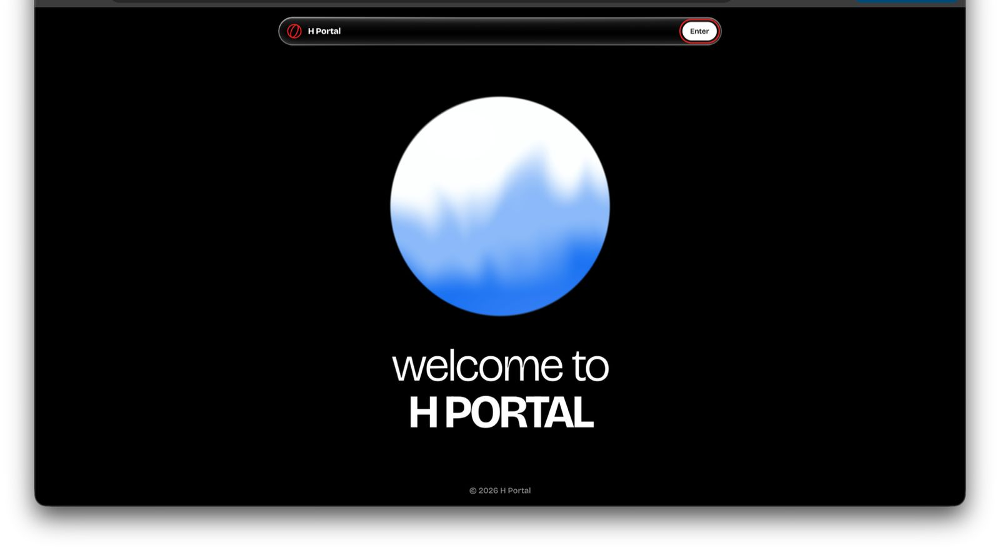

# H Portal

**haleemah's corner of the internet: research, content, community and AI creator campaigns, all on one page.**

One link answers the questions every brand asks before reaching out:
*Who is she? Who has she worked with? What are her numbers? How do I hire her?*

H Portal is a single-file personal site with liquid glass UI, a WebGL orb,
live-counting stats and a little "Ask H Portal" app built right into the page.

---

## Why H Portal

Working with brands means answering the same questions over and over:
what do you do, who have you worked with, what reach do you have, how do
we start. The answers usually live across a pinned post, a media kit PDF,
an analytics screenshot and a DM thread.

H Portal puts all of it in one place. Brands get the story, the proof and
the numbers in a couple of scrolls, and a clear way to get in touch at the
end. It's also a project in itself: built from scratch by a non-dev, with
no framework and no build step.

## Live site

Deployed link coming soon.

## What's inside

The page is laid out as a short scroll, top to bottom:

| Section | What it shows |
|---|---|
| **Welcome** | Liquid glass nav, a WebGL orb and an **Enter** button into the site |
| **Ticker** | A scrolling strip: AI ✦ research ✦ content ✦ community ✦ design ✦ creator ✦ builder ✦ campaigns ✦ strategy |
| **Stats strip** | 1.5M+ monthly impressions, 15.3K engagements in 7 days, 133% impressions growth, 8 brands worked with |
| **Ask H Portal** | A mini desktop-style app with a menu bar (File, Edit, View, Window, Help) and quick-question chips |
| **About** | A short intro with a **read more** popup: what I do, how it started, proof, how I work, right now |
| **Trusted by** | Brands I've worked with, each linking to their X profile |
| **Projects** | What I've built and am building, plus a GitHub activity card |
| **Services** | Five things I can do for your project |
| **Work with me** | What project representation gets you, with a full analytics panel and audience by country |
| **Right now** | What I'm building this week and the latest numbers |
| **Contact** | "let's build something", with DMs open on X and Telegram |

### Brands

Tavus · Thine · Higgsfield · Moonshot · Hedwig Studio · Hostinger ·
The Sandbox · ImagineArt · Antseed · Creatify · Brilliant · Vellum

### Projects

| Project | Status | What it is |
|---|---|---|
| Prompt Portal | building | A prompt library for creators to test new AI models, sorted by test type: game, frontend, animation, blender and architecture |
| [Robinhood Town](https://github.com/hsanni1/robinhood-town) | building | A token and NFT trading game, vibecoded from scratch |
| [EDITORMUHAMAD](https://editormuhamad.vercel.app) | built | A portfolio site for a motion designer |
| H Portal | built | This site |

### Services

1. **Content creation**: threads, posts and breakdowns that explain what you're building in a way people actually want to share
2. **Research**: deep dives into your product, market and competitors before a single word goes out
3. **AI creator campaigns**: sourcing and managing quality AI content creators, on brand and on target
4. **Community management**: growing the community around your project so they stick around
5. **Project representation**: your badge on my profile, putting your project in front of my audience every day

## How it works

H Portal is one `index.html` file. The HTML, CSS, JavaScript and images
all live inside it, so there is nothing to install and nothing to build.

**1. One file, zero dependencies.** Images are embedded as data URIs, so
the page works the same from a hard drive, a USB stick or a CDN. The only
outside request is Google Fonts (Bricolage Grotesque, JetBrains Mono and
Caveat).

**2. Liquid glass.** The nav, buttons and panels are layered glass:
`backdrop-filter` blur and saturation, a light top edge, a soft inner
highlight and a drop shadow, with an SVG noise texture for grain. Every
color is a CSS variable, so the same glass works in light and dark mode.

**3. The orb.** The hero orb is drawn with WebGL on a `<canvas>`, rendered
every frame with `requestAnimationFrame`.

**4. Things happen as you scroll.** An `IntersectionObserver` watches each
section and starts its animation when it comes into view: the counters
roll up from zero, the panels fade in.

**5. Ask H Portal.** The chat app runs entirely in the page. Tap a chip
like *who is haleemah?* and it answers from content written into the
site. The menu bar works too: copy an answer, copy my handle, toggle dark
mode, jump to projects or open a DM.

**6. Remembers your theme.** Your light/dark choice is saved in
`localStorage`, so the site looks the way you left it next time.

## Features

- **Light and dark mode**: follows your system setting by default, can be toggled from the Ask H Portal View menu, and is remembered per browser.
- **Live counters**: the stats count up from zero the first time you see them.
- **Read more popup**: the full about story opens in a glass modal without leaving the page.
- **Clickable brand wall**: every brand logo links to that brand on X.
- **Full analytics panel**: impressions, engagement rate, engagements, profile visits, replies, likes, reposts, bookmarks and shares, each with its growth.
- **Audience by country**: US, India, Nigeria, UK, Germany, Canada, Brazil and France.
- **GitHub card**: contribution count and recent repos, linking to [@hsanni1](https://github.com/hsanni1).
- **Copy to clipboard**: copy answers or my X handle in one click.
- **Mobile first**: layouts adjust at 760, 720, 640, 560 and 480 px, and respect the iPhone notch and home bar.
- **Reduced motion**: if your device asks for less motion, the animations calm down.

## Contact

Tell me what you're building, your goals and your timeline. My DMs are open.

- X: [@Haleeeemahh](https://x.com/Haleeeemahh)
- Telegram: [@Haleeeemahhh](https://t.me/Haleeeemahhh)
- GitHub: [@hsanni1](https://github.com/hsanni1)

## Credits

- Brand names and logos belong to their owners and are shown only to identify work done with them. H Portal is not endorsed by any of them.

## License

[MIT](LICENSE) © 2026 Haleemah
